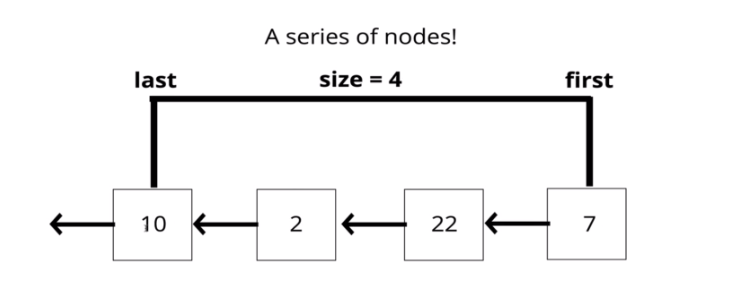
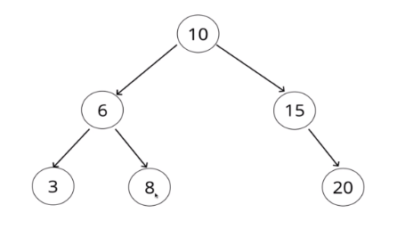
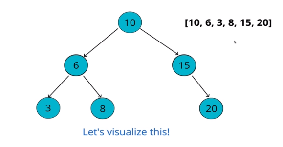
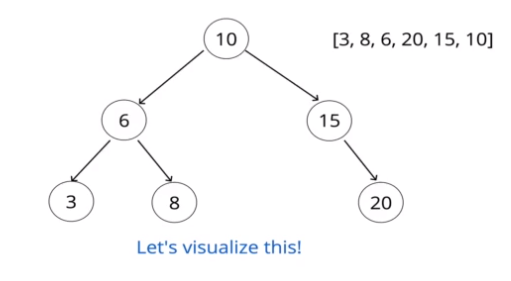
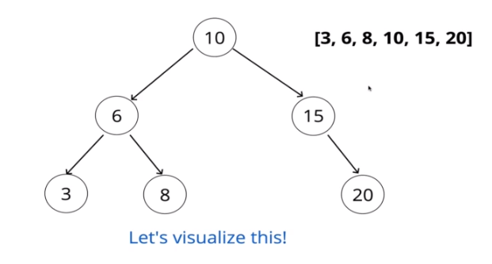
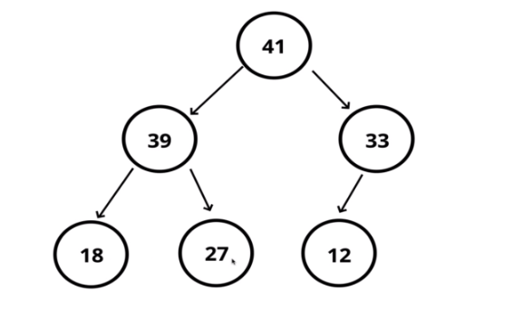
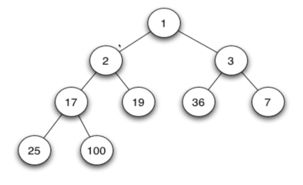
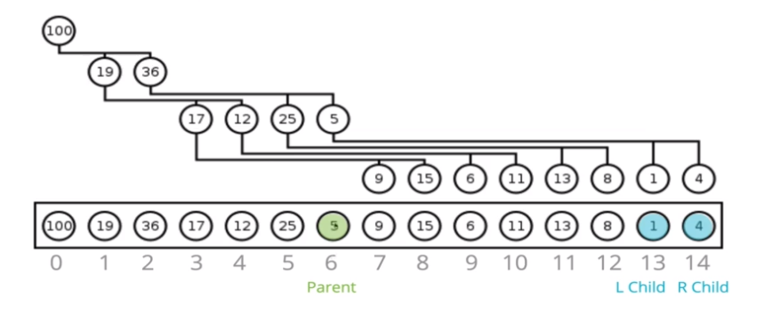
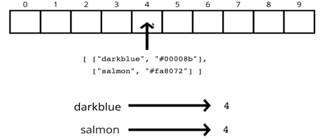
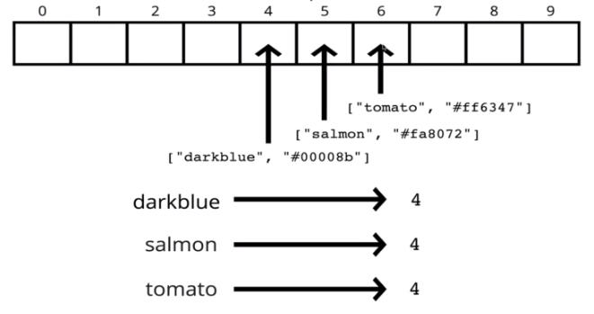

# Data Structures

**Contents**

[Introduction](#introduction)

[ES2015 Class Syntax](#es2015-class-syntax)

[Singly Linked Lists](#singly-linked-lists)

[Doubly Linked Lists](#doubly-linked-lists)

[Stacks](#stacks)

[Queues](#queues)

[Binary Search Trees](#binary-search-trees)

[Tree traversal](#tree-traversal)

[Binary Heaps](#binary-heaps)

[Priority Queue](#priority-queue)

[Hash Tables](#hash-tables)

Undirected Unweighted Graphs

Directed Graphs

---

## Introduction

### What do they do?

Data structures are collections of values, the relationships among them, and the functions or operations that can be applied to the data.

---

### Why so many?

Different data structures excel at different things. Some are highly specialized, while others (like arrays) are more generally used.

---

### Why care?

The more time you spend as a developer, the more likely you'll need to use one of these data structures

You've already worked with many of them unknowingly!

and of course...INTERVIEWS

There is no one **BEST** data structures, they all excel in different situations.

e.g.

Working with map/location data? Use a graph!

Need an ordered list with fast inserts/removals at the beginning and end? Use a linked list!

Web scraping nested HTML? Use a tree!

Need to write a scheduler? Use a binary heap!

---

## ES2015 Class Syntax

### What is a class?

A blueprint for creating objects with pre-defined properties and methods

---

### Why do we need to learn this?

We're going to implement **data structures** as **classes**!

**The Syntax**

```
class Student {
  constructor(firstName, lastName){
    this.firstName = firstName;
    this.lastName = lastName;
  }
}
```

The method to create new objects **must** be called constructor

The class keyword creates a constant, so you can not redefine it. Watch out for the syntax as well!

---

### Creating objects from classes

We use the **new** keyword

```
let firstStudent = new Student("Colt", "Steele");
let secondStudent = new Student("Blue", "Steele");
```

---

### Instance Methods

Relevant to individual instances

```
class Student {
  constructor(firstName, lastName){
    this.firstName = firstName;
    this.lastName = lastName;
    this.tardies = 0;
    this.scores = [];
  }

  fullName(){
    return `Your full name is ${this.firstName} ${this.lastName}`;
  }

  markLate(){
    this.tardies += 1;
    if(this.tardies >= 3){
      return "YOU ARE EXPELLED!!!"
    }
    return `${this.firstName} ${this.lastName} has been late ${this.tardies} times`;
  }

  addScore(score){
    this.scores.push(score)
    return this.scores;
  }

  calculateAverage(){
    let sum = this.scores.reduce(function(a,b){return a+b});
    return sum/this.scores.length;
  }
}

let firstName = new Student('Colt', 'Steele');

firstStudent.fullName();
firstStudent.markLate();
firstStudent.markLate();
firstStudent.addScore(92);
firstStudent.addScore(87);
firstStudent.scores // [92, 87]
firstStudent.calculateAverage();
```

---

### Class Methods

Using the `static` keyword in front of the definition. It's a utility function not related to single instances.

```
class Student {
  constructor(firstName, lastName){
    this.firstName = firstName;
    this.lastName = lastName;
  }

  fullName(){
    return `Your full name is ${this.firstName} ${this.lastName}`;
  }

  static enrollStudents(...students){
    // maybe send an email here
  }
}
```

```
Student.enrollStudents([firstStudent, secondStudent])
```

---

### One gotcha with `this`

Inside all of our **instance** methods and **constructor**, the keyword `this` refers to the object created from that class (also known as **instance**)

---

## Singly Linked Lists

### What is a linked list?

A data structure that contains a **head**, **tail**, and **length** property.

Linked Lists consists of nodes, and each **node** has a **value** and a **pointer** to another node or null

---

### Comparisons with Arrays

**Lists**

- Do not have indexes!
- Connected via nodes with a **next** pointer
- Random access is not allowed

**Arrays**

- Indexed in order!
- Insertion and deletion can be expensive
- Can quickly be accessed at a specific index

---

### Pushing

Adding a node to the \*\*end of the Single Linked List

#### Pushing pseudocode

- This function should accept a value
- Create a new node using the value passed to the function
- If there is no head property on the list, set the head and tail to be the newly created node
- Otherwise set the next property on the tail to be the new node and set the tail property on the list to be the newly created node
- Increment the length by one
- Return the linked list

---

### Popping

Removing a **node** from the end of the Linked List!

#### Popping pseudocode

- if there are no nodes in the list, return undefined
- Loop through the list until you reach the tail
- Set the next property of the 2nd to last node to be null
- Set the tail to be the 2nd to last node
- Decrement the length of the list by 1
- Return the value of the node removed

---

### Shifting

Removing a new **node** from the beginning of the Linked List!

#### Shifting pseudocode

- if there are no nodes, return undefined
- Store the current head property in a variable
- Set the head property to be the current head's next property
- Decrement the length by 1
- Return the value of the node removed

---

### Unshifting

Adding a new **node** to the beginning of the Linked List!

#### Unshifting pseudocode

- This function should accept a value
- Create a new node using the value passed to the function
- If there is no head property on the list, set the head and tail to be the newly created node
- Otherwise set the newly created node's next property to be the current head property on the list
- Set the head property on the list to be that newly created node
- Increment the length of the list by 1
- Return the linked list

---

### Get

Retrieving a **node** by it's position in the Linked List!

#### Get Pseudocode

- This function should accept an index
- if the index is less than zero or greater than or equal to the length of the list, return null
- Loop through the list until you reach the index and return the node at that specific index

---

### Set

Changing the **value** of a node based on it's position in the Linked List

#### Set pseudocode

- This function should accept a value and an index
- Use your **get** function to find the specific node.
- if the node is not found, return false
- if the node is found, set the value of that node to be the value passed to the function and return true

---

### Insert

Adding a node to the Linked List as a **specific position**

#### Insert pseudocode

- if the index is less than zero or greater than the length, return false
- if the index is the same as the length, push a new node to the end of the list
- if the index is 0, unshift a new node to the start of the list
- Otherwise, using the **get** method, access the node at the index -1
- Set the next property on that node to be the new node
- Set the next property on the new node to be the previous next
- Increment the length
- Return true

---

### Remove

Removing a node from the Linked List at a **specific** position

#### Remove pseudocode

- if the index is less than zero or greater or equal than the length, return undefined
- if the index is the same as the length - 1, pop
- if the index is 0, shift
- Otherwise, using the **get** method, access the node at the index -1
- Set the next property on that node to be the next of the next node
- Decrement the length
- Return the value of the node removed

---

### Reverse

Reversing the Linked List **in place**!

#### Reverse pseudocode

- Swap the head and tail
- Create a variable called next
- Create a variable called prev
- Create a variable called node and initialize it to the head property
- Loop through the list
- Set next to be the next property on whatever node is
- Set the next property on the node to be whatever prev is
- Set prev to be the value of the node variable
- Set the node variable to be the value of the next variable

---

### Big O of Single Linked Lists

- Insertion: O(1)

- Removal: It depends... O(1) or O(N)

- Searching: O(N)

- Access: O(N)

---

### Recap

- Singly Linked Lists are an excellent alternative to arrays when insertion and deletion at the beginning are frequently required
- Array contain a built in index whereas Linked Lists do not
- The idea of a list data structure that consists of nodes is the foundation for other data structures like Stacks and Queues

---

## Doubly Linked Lists

**Almost** identical to Singly Linked Lists, except every node has **another** pointer, to the **previous** node!

**Comparisons with Singly Linked Lists**

More memory === More Flexibility

It's **almost** always a tradeoff!

---

### Pushing

Adding a node to the \*\*end of the Doubly Linked List

#### Pushing pseudocode

- Create a new node with the value passed to the function
- If the head property is null set the head and tail to be the newly created node
- If not, set the next property on the tail to be that node
- Set the previous property on the newly created node to be the tail
- Set the tail to be the newly created
- Increment the length
- Return the Doubly Linked List

---

### Popping

Removing a node from the **end** of the Doubly Linked List.

#### Popping pseudocode

- if there is no head, return undefined
- Store the current tail in a variable to return later
- if the length is 1, set the head and tail to be null
- Update the tail to be the previous Node
- Set the newTail's next to null
- Decrement the length
- Return the value removed

---

### Shifting

Removing a node from the **beginning** of the Doubly Linked List.

- if length is 0, return undefined
- Store the current head property in a variable (we'll call it old head)
- if the length is one
  - set the head to be null
  - set the tail to be null
- Update the head to be the next of the old head
- Set the head's prev property to null
- Set the old head's next to null
- Decrement the length
- Return the old head

---

### Unshifting

Adding a node to the **beginning** of the Doubly Linked List

#### Unshifting pseudocode

- Create a new node with the value passed to the function
- if the length is 0
  - set the head to be the new node
  - set the tail to be the new node
- Otherwise
  - set the prev property on the head of the list to be the new node
  - set the next property on the new node to be the head property
  - update the head to be the new node
- increment the length
- Return the list

---

### Get

Accessing a node in a Doubly Linked List by its position

#### Get pseudocode

- if the index is less than 0 or greater or equal to the length, return null
- if the index is less than or equal to half the length of the list
  - loop through the list starting from the head and loop towards the middle
  - return the node once it is found
- if the index is greater than half the length of the list
  - loop through the list starting from the tail and loop towards the middle
  - return the node once it is found

---

### Set

Replacing the value of a node in a Double Linked List

#### Set pseudocode

- Create a variable which is the result of the **get** method at the index passed to the function
  - if the **get**method returns a valid node, set the alue of tha node to be the valued passed to the function
  - Return true

---

### Insert

Adding a node in a Doubly Linked List by a certain position

#### Insert pseudocode

- if the index is less than zero or greater than or equal to the length return false
- if the index is 0, **unshift**
- in the index is the same as the length, **push**
- use the **get** method to access the index -1
- set the next and prev properties on the correct nodes to link everything together
- increment the length
- return true

---

### Remove

Removing a node in a Doubly Linked List by a certain position.

#### Remove pseudocode

- if the index is less than zero or greater than or equal to the length return undefined
- if the index is 0, **shift**
- in the index is the same as the length -1, **pop**
- use the **get** method to retrieve the item to be removed
- update the next and prev properties to remove the found node from the list
- set next and prev to nul on the found node
- decrement the length
- return the removed node

---

### Big O of Doubly Linked Lists

- Insertion: O(1)
- Remove: O(1)
- Searching: O(N)
- Access: O(n)

Technically searching is O(N/2) but that's still O(N)

---

### Recap

- Doubly Linked Lists are almost identical to Singly Linked Lists except there is an additional pointer to previous nodes
- Better than Singly Linked Lists for finding nodes and can be done in half the time!
- However, they do take up more memory considering the extra pointer

---

## Stacks

### What is a Stack?

A **LIFO** data structure!

The last element added to the stack will be the first element removed from the stack

---

### How is it used?

This about a stack of **plates**, or a stack of **markers**, or a stack of... **anything**.

As you pile it up the last thing (or the topmost thing) is what gets removed first.



---

### Where stack are used

- The Call Stack!
- Managing function invocations
- Undo / Redo
- Routing (the history object) is treated like a stack!
- Trees / Graphs

---

There is more than one way of implementing a stack

### Array implementation

Using `push` and `pop` on a array, creates a stack (adding and removing from the end)

```
var stack = []

stack.push("google")
stack.push("instagram")
stack.push("youtube")

stack.pop()
```

or with `unshift` and `shift` (adding and removing from the beginning)

```
stack.unshift("create new file")
stack.unshift("resized file")
stack.unshift("cloned out wrinkle")

stack.shift()
```

as we've seen the pop and push method is better because we don't have to re-index all the elements in the array

but if you care about efficiency **you should use a linked list for a stack implementation**, because we don't access information based on an index

---

### Linked list implementation

```
class Node {
  constructor(value) {
    this.val = value;
    this.next = null;
  }
}

class Stack {
  constructor() {
    this.first = null;
    this.last = null;
    this.size = 0;
  }
}
```

Why cannot use the methods `push` and `pop` from the singly linked list, because they are not constant time! Had to traverse the whole list.

how it's better to use `shift` and `unshift` (but should called `push` and `pop`)

---

### Pushing

**Add** a value to the **top** of the stack!

#### Pushing pseudocode

- The function should accept a value
- Create a new node with that value
- If there are not nodes in the stack, set the first and last property to be the newly created node
- if there is at least one node, create a variable that stores the current first property on the stack
- reset the first property to be the newly created node
- set the next property on the node to be the previously created variable

---

### Pop

Removing and element from the top of the stack

#### Pop pseudocode

- if there are no nodes in the stack, return null
- Create a temporary variable to store the first property on the stack
- if there is only 1 node, set the first and last property to be null
- if there is more than one node, set the first property to be the next property on the current first
- decrement the size by 1
- return the value of the node removed

---

### Big O of Stacks

- Insertion: **O(1)**
- Removal: **O(1)**
- Searching - **O(N)**
- Access - **O(N)**

prioritizing insertion and removal, if you need searching and access maybe you should use another data structure like array.

---

### Recap

- Stacks are a **LIFO** data structure where the last value in is always the first one out.
- Stacks are used to handle function invocations (the call stack), for operations like undo / redo, and for routing (remember pages you have visited and go back / forwards) and much more!
- They are not a built in data structure in JavaScript but are relatively simple to implement

---

## Queues

A **FIFO** data structure!

**F**irst **I**n **F**irst **O**ut

### We've seen this before

Queues exist everywhere! Think about the last time you waited in line...

---

### How do we use them in programming?

- Background tasks
- Uploading resources
- Printing / Task processing

---

### Building a Queue with an array

with `push` and `shift`

```
var q = [];

q.push("FIRST");
q.push("SECOND");
q.push("THIRD");

q.shift();
q.shift();
```

or with the second way `unshift` with `pop`

```
q.unshift("FIRST")
q.unshift("SECOND")
q.unshift("THIRD")

q.pop()
q.pop()
```

---

### Stack implementation with list

With singly linked list, removing from the end using `pop` is slow, because you have to iterate over the entire list.

We have to add to the end `enque` and remove from the beginning `deque`.

### Enqueue pseudocode

- This function accepts some value
- Create a new node using that value passed to the function
- if there are no nodes in the queue, set this node to be the first and last property of the queue
- Otherwise, set the next property of the current last to be that node, and then set the last property of the queue to be that node
- increment the size of the queue by 1

---

### Dequeue pseudocode

- if there is no first property, just return null
- store the first property in a variable
- see if the first is the same as the last (check if there is only 1 node). If so, set the first and last to be null
- if there is more than 1 node, set the first property to be the next property of first
- decrement the size by 1
- return the value of the node dequeued

---

### Big O of Queues

Insertion: **O(1)**

Removal: **O(1)**

Searching: **O(N)**

Access: **O(N)**

---

### Recap

- Queues are a **FIFO** data structure, all elements are first in first out.
- Queues are useful for processing tasks and are foundational for more complex data structures
- Insertion and Removal can be done in **O(1)**

---

## Binary Search Trees

### What is a tree?

A data structure that consists of nodes in a **parent / child** relationship.

Lists - **linear**

Trees - **nonlinear**

---

### Tree terminology

- **Root**: The top node in a tree
- **Child**: A node directly connected to another node when moving away from the Root.
- **Parent**: The converse notion of a child.
- **Siblings**: A group of nodes with the same parent.
- **Leaf**: A node with no children
- **Edge**: The connection between one node and another.

---

### Use cases of Trees

- HTML DOM
- Network Routing
- Abstract Syntax Trees
- Artificial Intelligence
- Folders in Operating Systems
- Computer File Systems

---

### Kinds of Trees

- Trees
- Binary Trees
- Binary Search Trees

In **Binary Search Trees**, each node can have **at most 2 children**.

Also **they are sorted** in some way.

e.g. in BST with numbers, all numbers lower than the root are on the left side, and all numbers greater than the root are on the right side of the root, and you can repeat that on each child node.

---

### How BSTS work

- Every parent node has at most **two** children
- Every node to the left of a parent node is **always less** than the parent
- Every node to the right of a parent node is **always greater** than the parent



---

### The BinarySearchTree Class

```
class BinarySearchTree {
  constructor(){
    this.root = null
  }
}

class Node {
  constructor(value){
    this.value = value;
    this.left = null;
    this.right = null;
  }
}
```

### BST: Inserting a Node

**Steps - Iteratively or Recursively**

- Create a new node
- Starting at the root
  - Check if there is a root, if not - the root now becomes that new node!
  - if there is a root, check if the value of the new node is greater than or less than the value of the root
  - if it is greater
    - check to see if there is a node to the right
      - if there is, move to that node and repeat these steps
      - if there is not, add that node as the right property
  - if it is less
    - check to see if there is a node to the left
      - if there is, move to that node and repeat these steps
      - if there is not, add that node as the left property

---

### BST: Finding a Node

- Starting at the root
  - Check if there is a root, if not - we're done searching!
  - if there is a root, check if the value of the new node is the value we are looking for. If we found it, we're done!
  - if not, check to see if the value is greater than or less than the value of the root
  - if it is greater
    - Check to see if there is a node to the right
      - if there is, move to that node and repeat these steps
      - if there is not, we're done searching!
  - if it is less
    - Check to see if there is a node to the left
      - if there is, move to that node and repeat these steps
      - if there is not, we're done searching!

---

### Big O of BST

Insertion: **O( log n)**

Searching: **O( log n)**

**Not guaranteed!** might be one-sided

---

## Tree Traversal

Visit every node once

**Two ways:**

- Breadth-first Search
- Depth-first Search
  - DFS - InOrder
  - DFS - PreOrder
  - DFS - PostOrder

---

### BFS

**Steps - Iteratively**

- Create a queue (this can be an array) and a variable to store the values of nodes visited
- Place the root node in the queue
- Loop as long as there is anything in the queue
  - Dequeue a node from the queue and push the value of the node into the variable that stores the nodes
  - if there is a left property on the node dequeued - add it to the queue
  - if there is a right property on the node dequeued - add it to the queue
- Return the variable that stores the values

---

### DFS - PreOrder



**Steps - Recursively**

- Create a variable to store the values of nodes visited
- Store the root of the BST in a variable called current
- Write a helper function which accepts a node
  - Push the value of the node to the variable that stores the values
  - if the node has a left property, call the helper function with the left property on the node
  - if the node has a right property, call the helper function with the right property on the node
  - Invoke the helper function with the current variable

---

### DFS - PostOrder



**Steps - Recursively**

- Create a variable to store the values of nodes visited
- Store the root of the BST in a variable called current
- Write a helper function which accepts a node
  - if the node has a left property, call the helper function with the left property on the node
  - if the node has a right property, call the helper function with the right property on the node
  - Push the value of the node to the variable that stores the values
  - Invoke the helper function with the current variable

---

### DFS -InOrder



**Steps - Recursively**

- Create a variable to store the values of nodes visited
- Store the root of the BST in a variable called current
- Write a helper function which accepts a node
  - if the node has a left property, call the helper function with the left property on the node
  - Push the value of the node to the variable that stores the values
  - if the node has a right property, call the helper function with the right property on the node
  - Invoke the helper function with the current variable

---

### When to User BFS and DFS

- Trees are non-linear data structures that contain a root and child nodes
- Binary Trees can have values of any type, but at most two children for each parent
- Binary Search Trees are a more specific version of binary trees where every node to the left of a parent is less than it's value and every node to the right is greater
- We can search through Tress using BFS and DFS

---

## Binary Heaps

### Introduction

#### What is a Binary Heap?

**Very** similar to a binary search tree, but with some different rules!

In a **MaxBinaryHeap**, parent nodes are always larger than child nodes. In a **MinBinaryHeap**, parent nodes are always smaller than child nodes.

**Max Binary Heap**



left and right are not ordered like Binary Search Trees but are **less than the parent**

**Min Binary Heap**



---

#### Max Binary Heap

- Each parent has at most two child nodes
- The value of each parent node is **always** greater than its child nodes
- In a max Binary Heap the parent is greater than the children, but there are not guarantees between sibling nodes
- A binary heap is as compact as possible. All the children of each node are as full as they can be and left children are filled out first

---

#### Why do we need to know this?

Binary Heaps are used to implement Priority Queues, which are **very** commonly used data structures.

They are also used quite a bit, with **graph traversal** algorithms.

---

### Storing Heaps

We can store a heap in an array instead of a Tree Class and Node Class.



For any index of an array `n`

The **left child** is stored at `2n + 1`

The **right child** is at `2n + 2`

For any child node at index `n`

Its parent is at index `(n - 1)/2` floored

---

### Heap Insert

- Add to the end
- Bubble up

#### Insert pseudocode

- push the value into the values property on the heap
- bubble the
  - create a variable called index which is the length of the values property -1
  - create a variable called parentIndex which is the floor of (index - 1)/2
  - keep looping as long as the values element at the parentIndex is less than the values element at the child index
    - swap the value of the values element at the parentIndex with the value of the element property at the child index
    - set the index to be the parentIndex, and start over!

---

### Removing from a heap

- Remove the root
- Replace with the most recently added
- Adjust (sink down)

---

### Sink down

The procedure for deleting the root from the heap (effectively extracting the maximum element in a max-heap or the minimum element in a min-heap) and restoring the properties is called **down-heap** (also know as bubble-down, percolate-down, sift-down, trickle down, heapify-down, cascade-down, and extract-min/max)

---

### Removing pseudocode

(also called extractMax)

- Swap the first value in the values property with the last one
- Pop from the values property, so you can return the value at the end.
- Have the new root **sink down** to the correct spot
  - Your parent index starts at 0 (the root)
  - Find the index of the left child: 2\*index + 1 (make sure its not out of bounds)
  - Find the index of the right child: 2\*index + 2 (make sure its not out of bounds)
  - if the left or right child is greater than the element..swap. If both left and right children are larger, swap with the largest child.
  - The child index you swapped to now becomes the new parent index.
  - Keep looping and swapping until neither child is larger than the element.
  - Return the old root!

---

## Priority Queue

### What is a Priority Queue?

A data structure where each element has a priority. Elements with higher priorities are served before elements with lower priorities.

**A naive version**

Use a list to store all elements

```
priority: 3 priority: 1 priority: 2 priority: 5; priority: 4
```

Iterate over the entire thing to find the highest priority element

---

### Priority Queue pseudocode

Like a heap:

```
Class Name:
  PriorityQueue
Properties:
  values = []
```

But also

```
Class Name:
  Node
Properties:
  val
  priority
```

- Write a Min Binary Heap - lower number means higher priority.
- Each Node has a val and a priority. Use the priority to build the heap.
- **Enqueue** method accepts a value and priority, makes a new node, and puts it in the right spot based off of its priority
- **Dequeue** method removes root element, returns it, and rearranges heap using priority.

---

### Big O of Binary Heaps

Insertion: **O(log N)**

Removal: **O(log N)**

Search: **O(N)**

---

### Recap

- Binary Heaps are very useful data structures for sorting, and implementing other data structures like priority queues
- Binary Heaps are either MaxBinaryHeaps or MinBinaryHeaps with parents either being smaller or larger than their children
- With just a little bit of math, we can represent heaps using arrays!

---

## Hash Tables

### Introduction

Hash table are used to store **key-value** pairs.

They are like arrays, but the keys are not ordered.

Unlike arrays, hash tables are **fast** for all of the following operations, finding values, adding new values, and removing values!

---

#### Why should I care ?

Nearly every programming language has some sort of hash table data structure.

Because of their speed, hash tables are very commonly used!

---

#### Hash tables in the wild

- Python has Dictionaries
- JS has Objects and Maps\*
- Java, Go & Scala have Maps
- Ruby has...Hashes

Objects have some restrictions, but are basically hash tables

---

#### Hash tables Introductory Example

Imagine we want to store some colors

We could just use an array/list:

```
["#ff69b4", "#ff4500", "#00ffff"]
```

Not super readable! What do these colors correspond to?

It would be nice if instead of using indices to access the colors, we could use more human-readable keys

pink ----> #ff69b4

orangered ----> #ff4500

cyan ----> #00ffff

`colors["cyan"]` is way better than `colors[2]`

How can we get human-readability and computer readability?

Computers don't know how to find an element at index **pink**!

---

### Hash Functions

---

#### The Hash Part

To implement a hash table, we'll be using an array.

In order to look up values by key, we need a way to **convert keys into valid array indices**

A function that performs this task is called a **hash function**

---

#### Hashing Conceptually

```
  0   1   2   3
|   |   |   |   |


["pink", "#ff69b4]: 0

["cyan", "#00ffff]: 3

["orangered", "#ff4500"]: 7
```

---

#### Intro to hash functions

example of fixed output hash function

```
hash("hello!") // -634239776592374478
hash("Hello!") // -7665438013419399415
hash("a")      // -5015914058988233448
hash("fsadfasdfdsasfddsfafdfaafsfdsfafdaffdasfdsafdaadsff")
               // -430105209470529753
```

---

#### What makes a good Hash?

(not a cryptographically secure one)

1. Fast (i.e. constant time)

2. Doesn't cluster outputs at specific indices, but distributes uniformly

3. Deterministic (same input yields same output)

**Not a fast example**

```
function slowHash(key){
  for(var i = 0; i < 10000; i++){
    console.log("everyday i'm hashing");
  }
  return key[0].charCodeAt(0);
}
```

**Not Uniformly distributes values**

```
function sameHashedValue(key){
  return 0;
}
```

**Not Deterministic**

```
function randomHash(key){
  return Math.floor(Math.random() * 1000)
}
```

---

### First hash function

```
hash("pink", 100) // second arg the length of the array


function hash(key, arrayLen){
  let total = 0;
  for(let char of key){
    // map "a" to 1, "b" to 2, "c" to 3, etc
    let value = char.charCodeAt(0) - 96;
    total = (total + value) % arrayLen;
  }
  return total;
}
```

---

#### Problems with our current hash

1. Only hashes strings (we won't worry about this)

2. Not constant time - linear in key length

3. Could be a little more random

---

#### Hashing Revisited

```
function hash(key, arrayLen){
  let total = 0;
  let WEIRD_PRIME = 31;
  for(let i = 0; i < Math.min(key.length, 100); i++){
    let char = key[i];
    let value = char.charCodeAt(0) - 96;
    total = (total*WEIRD_PRIME + value) % arrayLen;
  }
  return total;
}
```

---

#### Prime numbers? wut.

The prime number in the hash is helpful in spreading out the keys more uniformly.

It's also helpful if the array that you're putting values into has a prime length.

You don't need to know why. (Math is complicated!)
But here are some links if you're curious.

- Why do hash functions use prime numbers?
- Does making array size a prime number help in hash table implementation?

---

### Dealing with Collisions

Even with a large array and great hash function, collisions are inevitable.

There are many strategies for dealing with collisions, but we'll focus on two:

1. Separate Chaining
2. Linear Probing

---

#### Separate Chaining

With **separate chaining**, at each index in our array we store values using a more sophisticated data structure (e.g. an array or a linked list)

This allows us to store multiple key-value pairs at the same index.



---

#### Linear Probing

With **linear probing**, when we find a collision, we search through the array to find the next empty slot.

Unlike with separate chaining, this allows us to store a single key-value at each index.



---

### A HashTable Class

#### Set / Get

**set**

1. Accepts a key and a value
2. Hashes the key
3. Stores the key-value in the hash table array via separate chaining

**get**

1. Accepts a key
2. Hashes the key
3. Retrieves the key-value pair in the hash table
4. If the key isn't found, returns undefined

---

#### Keys / Values

**keys**

1. Loops through the hash table array and returns an array of keys in the table

**values**

1. Loops through the hash table array and returns an array of values in the table

---
